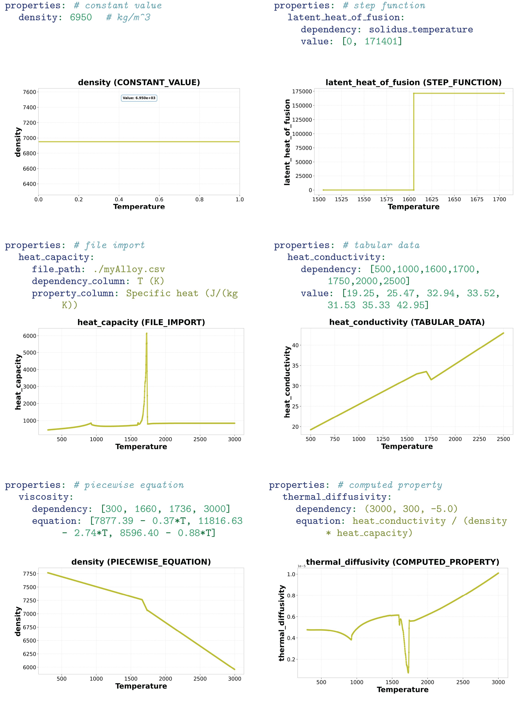

# Summary

MaterForge is an extensible, open-source Python library that streamlines the definition and use of
material properties in numerical simulations.
The library supports complex material behaviors, from simple constants to experimental data,
in user-friendly YAML configurations.
These are internally converted into symbolic mathematical expressions for scientific computing frameworks.
MaterForge supports any material type through a schema-agnostic design,
provides flexible property definitions,
and automatically resolves dependency order for derived properties while detecting cycles.
It is designed for high-performance computing (HPC) applications
and serves as a bridge between experimental data and numerical simulation.

# Statement of Need

Accurate numerical simulations of physical processes rely on well-characterized material properties -
quantities such as thermal conductivity, density, and viscosity that depend on state variables like temperature, pressure, or strain rate [@lewis1996finite].
This challenge is compounded by the wide variation in data availability,
from well-characterized models for established materials to sparse experimental points for novel materials.
Property definitions consequently range from simple constants to complex tabular datasets or sophisticated equations,
creating significant integration hurdles for researchers.

To manage this complexity, researchers often resort to manual interpolation, custom scripting, or proprietary software,
which compromises reproducibility and standardization [@ashby2013materials].
While valuable resources like the NIST WebBook [@linstrom2001nist] and CoolProp [@coolprop] provide raw data,
they lack integrated processing to unify these varied formats into simulation-ready symbolic expressions.
Thermodynamic modeling tools such as pycalphad [@pycalphad] and CALPHAD databases [@calphad]
are powerful for phase equilibria calculations but operate at a different layer of the workflow:
they generate property data, not simulation-ready expressions.

This creates a gap between property data generation and simulation integration,
leading to ad hoc solutions that hinder workflow efficiency and FAIR data adoption [@wilkinson2016fair].
MaterForge fills this gap by occupying a dedicated post-processing layer in the materials simulation workflow,
complementing rather than competing with thermodynamic modeling tools:
pycalphad generates the data; MaterForge prepares it for simulation.

# Position in the Simulation Workflow

MaterForge is designed to operate as the intermediate layer in a three-stage workflow:

**Stage 1 - Property Data Generation**: Raw material property data is produced by
upstream tools such as pycalphad [@pycalphad] for thermodynamic phase equilibria,
CoolProp [@coolprop] or the NIST WebBook [@linstrom2001nist] for fluid properties,
or commercial tools such as JMatPro and Thermo-Calc for alloy properties,
or direct experimental measurement.
These tools generate tabular data, equations, or database entries.

**Stage 2 - MaterForge Post-Processing**: MaterForge ingests this data via YAML configuration files
and converts it into optimized symbolic mathematical expressions using SymPy [@sympy].
It performs automatic regression and data reduction, resolves inter-property dependencies,
validates configurations, and generates visualization plots for verification.
The output is a fully configured `Material` object in which each property is stored as a symbolic expression - a callable function of a chosen dependency variable such as temperature, pressure, or composition - ready for direct use in simulation codes.

**Stage 3 - Simulation Integration**: The symbolic expressions are passed directly into
simulation frameworks such as pystencils [@pystencils] or waLBerla [@walberla]
for code generation, or into any Python-based finite element or CFD solver.
Because properties are SymPy expressions, they plug into symbolic assignment collections
without any additional conversion.

# Key Functionality

- **Flexible Input Methods**: The library supports various property definition methods such as
  constant values, step functions, file-based data (.xlsx, .csv, .txt), tabular data, piecewise equations, and computed properties 
  (\autoref{fig:input_methods}).
  This versatility allows users to leverage data from diverse sources.

- **Schema-Agnostic Material Support**: The framework imposes no structural constraints on material definitions.
  Any material kind - pure metals, alloys, ceramics, polymers, composites, or hypothetical materials -
  and any property name are valid. The only required YAML fields are `name` and `properties`.
  This design has been validated across steel alloys, aluminum, and Al2O3 ceramic configurations.

- **Automatic Dependency Resolution**: For dependent properties 
  (e.g., thermal diffusivity calculated from thermal conductivity, density, and heat capacity),
  MaterForge automatically determines the correct processing order, resolves mathematical dependencies,
  and detects circular references.

- **Regression and Data Reduction**: The library performs piecewise regression for large datasets, 
  simplifying complex property curves into efficient mathematical representations with configurable polynomial degrees and segment counts, 
  reducing computational overhead while maintaining accuracy.

- **Intelligent Simplification Timing**: MaterForge provides sophisticated control over when data simplification occurs
  via the `simplify` parameter.
  `simplify: pre` optimizes performance by simplifying properties before they are used in dependent calculations,
  while `simplify: post` defers simplification until all dependent properties have been computed, maximizing numerical accuracy.



- **Configurable Boundary Behavior**: Users can define how properties behave outside their specified ranges,
  choosing between `constant`-value clamping or `linear` extrapolation to best match the physical behavior of the material.
  The boundary behavior options work seamlessly with the regression capabilities to provide comprehensive data processing control 
  (\autoref{fig:regression_options_with_boundary_behavior}).

```yaml
    bounds: [constant, linear]
    regression:
      simplify: pre
      degree: 2
      segments: 3
```


- **Inverse Property Computation**: The library can generate inverse piecewise-linear functions,
  enabling the determination of the independent variable from a known property value.
  This capability is essential for energy-based numerical methods [@voller1987fixed],
  where temperature is recovered via the inverse of the specific enthalpy function.

- **Built-in Validation Framework**: A comprehensive validation framework checks YAML configurations for correctness,
  including structural validation, required fields, property type detection, and dependency cycle detection,
  preventing common configuration errors before simulation begins [@roache1998verification].

- **Integrated Visualization**: An integrated visualization tool
  automatically generates plots to verify property definitions,
  with the option to disable visualization for production workflows.

# Usage

Materials are defined in YAML files and loaded via `create_material`, which returns a fully configured `Material` object.
All material properties live in the `properties` block - the only other required top-level field is `name`.
Named properties can be referenced in other property configurations: scalar constants are
valid anywhere, while full expressions are valid in `COMPUTED_PROPERTY` equations only.
MaterForge automatically resolves the correct evaluation order.

## YAML Configuration Example: `myAlloy.yaml`
```yaml
name: myAlloy
properties:
  solidus_temperature: 1605.0
  liquidus_temperature: 1735.0
  density:
    file_path: ./myAlloy.csv
    dependency_column: T (K)
    property_column: Density (kg/m^3)
    bounds: [constant, linear]
    regression:
      simplify: pre
      degree: 1
      segments: 3
```

## Python Integration
```python
import sympy as sp
from materforge.parsing.api import create_material

# Define the dependency variable and load material from YAML
T = sp.Symbol('T')
myAlloy = create_material('myAlloy.yaml', T, enable_plotting=True)

# Access a symbolic property expression - a SymPy Piecewise function of T
density_expr = myAlloy.density

# Evaluate all properties at 500 K - returns a new Material with numeric values
myAlloy_at_500K = myAlloy.evaluate(T, 500.0)
print(float(myAlloy_at_500K.density))   # numeric density at 500 K
```

# Research Applications

MaterForge is applicable to alloy design [@callister2018materials],
finite element analysis [@hughes2012finite], multiscale modeling [@tadmor2011modeling],
computational fluid dynamics, and heat transfer.
Its architecture promotes reproducible science and is well-suited for HPC environments,
with demonstrated integrations into frameworks like pystencils [@pystencils] and waLBerla [@walberla].

# Availability

MaterForge is distributed under the [BSD-3-Clause License](https://github.com/rahildoshi97/materforge/blob/master/LICENSE). 
The source code is hosted on [GitHub](https://github.com/rahildoshi97/materforge), with
[full documentation](https://materforge.readthedocs.io/en/stable/) 
and [YAML examples](https://materforge.readthedocs.io/en/stable/how-to/define_materials.html).
The package can be installed via [PyPI](https://pypi.org/project/materforge/) using `pip install materforge`.

# AI Usage Disclosure

GitHub Copilot (VS Code) was used during source code development for boilerplate completions,
class scaffolding, and exception handling patterns.
Claude Sonnet 4.6 was used during the review and release cycle for targeted
code refactoring, documentation correction, and manuscript editing.
All AI-assisted outputs were reviewed, edited, and validated by the human authors,
who designed the overall code architecture and take full responsibility for the accuracy and
correctness of all submitted materials.

# Acknowledgements

This work was funded by the European High Performance Computing Joint Undertaking (Grant No. 101093457)
and the Deutsche Forschungsgemeinschaft within Research Unit FOR-5134 (Grant No. 434946896).

# References
