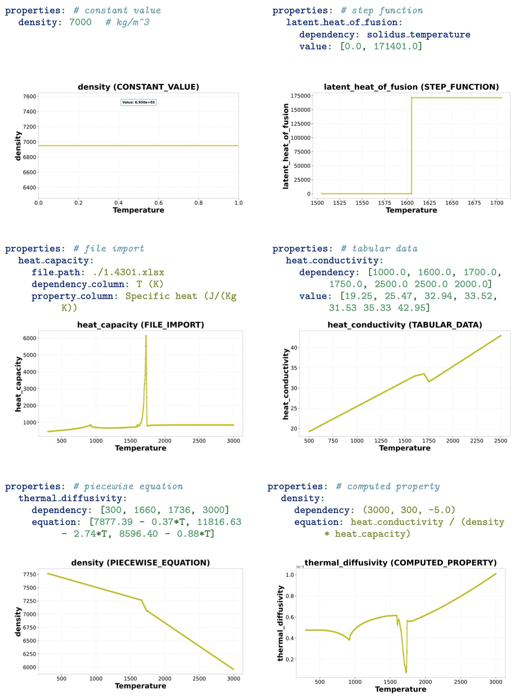

# Summary

MaterForge is an extensible, open-source Python library that streamlines the definition and use of
material properties in numerical simulations.
The library allows users to define complex material behaviors-ranging from simple constants to experimental data
in human-readable YAML configuration files.
These are automatically converted into symbolic mathematical expressions for direct use in scientific computing frameworks.
MaterForge supports different material types,
offers multiple property definition methods,
and intelligently manages dependencies between different material properties.
It is designed for high-performance computing applications,
and serves as a seamless bridge between experimental data and numerical simulation,
making sophisticated material modeling accessible to a broader scientific community.

# Statement of Need

Accurate numerical simulation requires accounting for material properties such as thermal conductivity, density, and viscosity
that are not constant but depend on variables like temperature, pressure, or strain rate [@lewis1996finite; @zienkiewicz2013finite].
This challenge is compounded by the wide variation in data availability,
from well-characterized models for established materials to sparse experimental points for novel materials.
Consequently, property definitions can range from simple constants to complex tabular datasets or sophisticated equations,
creating a significant integration hurdle for researchers.

To manage this complexity, researchers often resort to manual interpolation, custom scripting, or proprietary software,
which compromises reproducibility and standardization [@ashby2013materials].
While valuable resources like the NIST WebBook [@nist_webbook] and libraries such as CoolProp [@coolprop] exist,
they typically provide raw data without the integrated processing needed to unify these varied formats.
Similarly, specialized CALPHAD databases [@calphad] are powerful but often require proprietary software
and do not easily integrate with general-purpose simulation codes.

This gap forces the development of ad-hoc solutions, hindering workflow efficiency and the adoption of FAIR data principles [@wilkinson2016fair].
MaterForge was created to bridge this gap by providing a unified, open-source framework that leverages
symbolic mathematics, automatic regression, and dependency resolution to handle these disparate data sources.
By combining a user-friendly YAML configuration with powerful backend processing,
MaterForge standardizes and simplifies the integration of realistic material behavior into scientific simulations.

# Key Functionality

- **Flexible Input Methods**: The library supports different property definition methods like
  constant values, step functions, file-based data (xlsx, CSV, txt), tabular data, piecewise equations, and computed properties (\autoref{fig:input_methods}).
  This versatility allows users to leverage data from diverse sources,
  with robust file processing handled using pandas [@pandas].



- **Universal Material Support**: The framework is designed with an extensible architecture to support any material type.
  It is currently implemented and thoroughly tested for pure metals and alloys through it's unified interface,
  with a modular design that allows for straightforward extension to other material classes such as
  ceramics, polymers or composites.

- **Automatic Dependency Resolution**: For properties that depend on others (e.g., thermal diffusivity calculated from thermal conductivity, density, and heat capacity),
  MaterForge automatically determines the correct processing order and resolves mathematical dependencies without manual intervention.
  The library detects circular dependencies and provides clear error messages for invalid configurations,
  freeing users from complex dependency management.

- **Configurable Boundary Behavior**: Users can define how properties behave outside their specified ranges,
  choosing between constant-value or extrapolation to best match the physical behavior of the material.
  The boundary behavior options work seamlessly with the regression capabilities to provide comprehensive data processing control
  (\autoref{fig:regression_options_with_boundary_behavior_new}).
```yaml
    bounds: [constant, extrapolate]  # 'constant' or 'extrapolate'
```

- **Regression and Data Reduction**: The library integrates pwlf [@pwlf] to perform piecewise regression for large datasets.
  This simplifies complex property curves into efficient mathematical representations with configurable polynomial degrees and segments,
  reducing computational overhead while maintaining physical accuracy (\autoref{fig:regression_options_with_boundary_behavior_new}).
```yaml
    regression:      # Optional regression configuration
      simplify: pre  # 'pre' (before processing) or 'post' (after processing)
      degree: 2      # Polynomial degree for regression
      segments: 3    # Number of piecewise segments
```


- **Intelligent Simplification Timing**: MaterForge provides sophisticated control over when data simplification occurs
  in the dependency chain via the `simplify` parameter.
  `simplify: pre` simplifies properties before they are used in dependent calculations, optimizing performance.
  With `simplify: post`, simplification is deferred until all dependent properties have been computed, maximizing numerical accuracy.
  This timing control allows users to balance computational efficiency with numerical accuracy based on their specific simulation requirements.

- **Bidirectional Property-Variable Inversion**: The library can automatically generate inverse piecewise functions,
  enabling the determination of independent variables from known property values.
  This capability essential for energy-based numerical methods and iterative solvers[@voller1987fixed],
  where temperature is computed via the inverse function of the enthalpy.
  While currently focused on single-dependent variables like temperature,
  the underlying architecture is designed to support multiple independent variables (e.g., pressure, shear rate) in the future.
  The inversion supports linear piecewise segments,
  either via default linear interpolation or explicit regression,
  ensuring robust mathematical invertibility.

- **Built-in Validation Framework**: A comprehensive validation framework checks YAML configurations for correctness,
  including composition sums, required fields for pure metals versus alloys, and valid property names.
  This prevents common configuration errors and ensures reproducible material definitions [@roache1998verification].

- **Integrated Visualization**: An integrated visualization tool using matplotlib [@matplotlib]
  allows users to automatically generate plots to verify their property definitions visually,
  with the option to disable visualization for production workflows after validation.

# Usage

A material is defined in a YAML file and loaded with a single function call.
The following example demonstrate an alloy configuration, followed by the Python code to load and use the material.

## YAML Configuration Example: Alloy (`steel.yaml`)
```yaml
name: Steel 1.4301
material_type: alloy

# Composition fractions must sum to 1.0
composition:
  Fe: 0.675  # Iron
  Cr: 0.170  # Chromium
  Ni: 0.120  # Nickel
  Mo: 0.025  # Molybdenum
  Mn: 0.010  # Manganese

# Required temperature properties for alloys
solidus_temperature: 1605.          # Melting begins (K)
liquidus_temperature: 1735.         # Material is completely melted (K)
initial_boiling_temperature: 3090.  # Boiling begins (K)
final_boiling_temperature: 3200.    # Material is completely vaporized (K)

properties:
  density:
    file_path: ./1.4301.xlsx
    temperature_header: Temperature (K)
    value_header: Density (kg/(m)^3)
    bounds: [constant, extrapolate]
    regression:      # Optional regression configuration
      simplify: pre  # Simplify before processing
      degree: 2      # Use quadratic regression for simplification
      segments: 3    # Fit with 3 segments for piecewise linear approximation
```
Complete YAML configurations for different materials are provided in the MaterForge [documentation](https://github.com/rahildoshi97/pymatlib/blob/master/docs/how-to/define_materials.md).

## Python Integration
The primary entry point is the create_material function, which parses the YAML file and returns a fully configured material object.
```python
    import sympy as sp
    from MaterForge.parsing.api import create_material

    # Create a material with a symbolic temperature variable
    T = sp.Symbol('T')
    steel = create_material('steel.yaml', T, enable_plotting=True)

    # Access properties as symbolic expressions
    print(f"Density: {steel.density}")
    # Output: Piecewise((2678.43051234161, T < 300.0), 
    #                   (2744.36352618972 - 0.21977671282703*T, T < 3000.0), 
    #                   (2085.03338770863, True))

    # Evaluate properties at a specific temperature
    density_at_500K = steel.evaluate_properties_at_temperature(500.0)
    print(f"Density at 500 K: {density_at_500K:.2f} kg/m^3")
    # Output: Density at 500 K: 2634.48 kg/m^3
```

# Comparison with Existing Tools

| Feature                  | **MaterForge**      | **CoolProp** | **NIST WebBook** | **CALPHAD** |
|:-------------------------|:------------------|:-------------|:-----------------|:------------|
| **Core Capabilities**    |                   |              |                  |             |
| Symbolic Integration     | Yes               | No           | No               | No          |
| Dependency Resolution    | Yes (Automatic)   | No           | No               | No          |
| Multiple Input Methods   | Yes (6 types)     | No           | No               | No          |
|                          |                   |              |                  |             |
| **Material Support**     |                   |              |                  |             |
| Solid Materials          | Yes               | Limited      | Yes              | Yes         |
| Custom Properties        | Yes (Any)         | No           | No               | Limited     |
| Temperature Dependencies | Yes               | Yes          | Yes              | Yes         |
|                          |                   |              |                  |             |
| **Accessibility**        |                   |              |                  |             |
| Open Source              | Yes               | Yes          | No               | No          |
| Python Integration       | Native            | Yes          | API only         | No          |

**Key Advantage**: MaterForge's unique combination of native symbolic mathematics via SymPy [@sympy],
automatic dependency resolution, and multiple input methods provides a level of flexibility and integration
not found in existing tools, enabling more reproducible and sophisticated scientific simulations.

# Research Applications and Availability

MaterForge is applicable to a wide range of research areas, including alloy design and optimization [@callister2018materials],
finite element analysis [@hughes2012finite], multiscale modeling [@tadmor2011modeling],
computational fluid dynamics and heat transfer.
Its architecture promotes reproducible science and is well-suited for high-performance computing environments,
with demonstrated integrations into frameworks like pystencils [@pystencils] and waLBerla [@walberla].

MaterForge is an open-source software distributed under the [BSD-3-Clause License](https://github.com/rahildoshi97/pymatlib/blob/master/LICENSE).
The source code, comprehensive documentation, and example configurations are available on
[GitHub](https://github.com/rahildoshi97/pymatlib/tree/master).

# Acknowledgements

This work was funded by the European High Performance Computing Joint Undertaking and
Poland, Germany, Spain, Hungary, France and Greece under grant agreement number: 101093457.
Additional funding was provided by the Deutsche Forschungsgemeinschaft e.V. (DFG, German Research Foundation)
and carried out within the framework of Research Unit FOR-5134, “Solidification Cracks during Laser Beam Welding:
High Performance Computing for High Performance Processing”, (Grant No. 434946896).
We thank Carola Forster for providing the material data for steel 1.4301 using JMatPro.

# References
